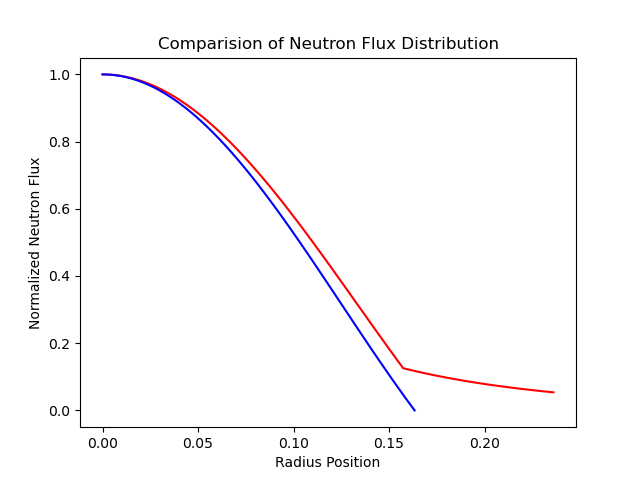

# 核反应堆物理大作业

## 1. 问题描述

选定反应堆的堆芯材料及反射层材料，假设堆芯和反射层区域材料均匀混合。基于单群扩散理论，分别计算裸堆及堆芯外层包裹无限厚度反射层条件下的临界直径，并比较两种条件下的中子通量密度分布。要求给出设计过程中的详细计算分析步骤及依据。

## 2. 研究对象

热离子反应堆电源在空间核动力研究中占有举足轻重的地位，是目前空间堆开发中技术最为成熟的一类，本文选取TOPAZ-II系统作为研究对象。

上图给出了该系统的概貌及结构示意图。反应堆分系统主要包括热离子燃料元件、氢化锆慢化剂、冷却剂环管、控制转鼓及其驱动机构、氧化铍反射层、支撑结构等，是TOPAZ-II系统的核心部分，集核燃料裂变产能与发电于一体；冷却剂回路主要由堆芯出口冷却剂管道、堆芯入口冷却剂管道、直流电磁泵、体积补偿器、辐射器等组成。

## 3. 堆芯及反射层

TOPAZ-II反应堆是一个小型的氢化锆慢化热中子反应堆，其结构如下图所示。反应堆堆芯由37根热离子燃料元件、冷却剂、慢化剂和堆内构件等组成。热离子燃料元件同心地排列成四圈，各圈燃料元件的数量分别为：1、6、12、18，除位于中心的燃料元件外，其它各圈燃料元件的布置半径分别为：37mm、67mm、105mm。37根燃料元件分别插入37个环形冷却剂通道的不锈钢内套管中，内套管放置在慢化剂不锈钢外套管的孔道内。内、外套管构成环形冷却剂流道。环形冷却剂通道长485mm，外半径12.95mm，内半径12.25mm，冷却剂从0.7mm的环形通道中流过堆芯，将热离子燃料元件中没有转化为电能的废热排出堆芯。慢化剂位于反应堆堆芯容器的筒体内，37对同轴的双层管子同心排列成四圈放在慢化剂圆盘的孔中。

热离子燃料元件TFE结构如下图

TFE的材料与几何参数如下：

|     结构     |          材料          | 内外半径/$mm$ |
| :----------: | :--------------------: | :-------------: |
|     燃料     |        $UO_2$        |     4.0/8.5     |
|    发射极    | 多晶钼铌合金（钨涂层） |    9.65/9.8    |
|    接收极    |       多晶钼合金       |   10.3/11.85   |
| 冷却剂内套管 |         不锈钢         |   11.9/12.25   |
|    冷却剂    |        钠钾-78        |   12.25/12.95   |
| 冷却剂外套管 |         不锈钢         |   12.95/13.3   |
|   CO2 气隙   |        $CO_2$        |   13.3/13.75   |

为方便处理，对实际模型进行简化，将堆芯除了燃料与冷却剂外的结构均视为慢化剂处理，由此得到简化后的空间堆模型。

简化后的热离子燃料元件TFE结构如下图

堆芯截面的直径为260mm，由此可以计算燃料、冷却剂、慢化剂的相对含量，进而均匀化处理堆芯。

### 3.1 燃料

$UO_2$具有熔点高，化学惰性，与冷却剂、锆包壳相容性好等优点，TOPAZ-II的燃料选用$UO_2$，燃料富集度96%，在TFE截面中，燃料的形状是内外半径分别为4.0mm，8.5mm，堆芯含有37根热离子燃料元件，因此可以计算得：

$$
\frac{V_{UO_2}}{V_{total}} = \frac{37\pi(r^2_2-r^2_1)}{\pi d_{total}^2 /4} \approx 12.32\%
$$

### 3.2 冷却剂

钠钾合金具有热物性、低凝固温度和加工工艺成熟的优点，是空间核反应堆技术中使用较为广泛的一类金属冷却剂。TOPAZ-II采用配比为22%钠和78%钾的钠钾合金作为冷却剂，在TFE截面中，冷却剂通道的形状是内外半径分别为12.25mm，12.95mm，堆芯含有37根热离子燃料元件，因此可以计算得：

$$
\frac{V_{Na-K}}{V_{total}} = \frac{37\pi(r^2_2-r^2_1)}{\pi d_{total}^2 /4} \approx 3.86\%
$$

### 3.3 慢化剂

选择慢化剂需要考虑中子性能，即要求慢化能力好，中子吸收截面尽可能小，
有较大的慢化比。TOPAZ-II选用氢化锆作慢化剂。在近似处理中，堆芯内除燃料与冷却剂全部视为慢化剂，因此有：

$$
\Sigma \frac{V_{i}}{V_{total}} = 100 \%
$$

$$
\\frac{V_{ZrH_2}}{V_{total}} = 100\% - (\frac{V_{Na-K}}{V_{total}}+\frac{V_{UO_2}}{V_{total}}) \approx 83.82\%
$$

### 3.4 反射层

$BeO$工作温度高，并且反射能力强于石墨，还有导热性能好，热膨胀系数小，抗高温氧化性能好等优点，TOPAZ-II选用铍作为反射层。

本文在无限厚反射层堆模型中作简化处理，视为在裸堆圆柱体侧面包裹径向无限厚的$BeO$作为反射层。

## 4. 物性参数

### 4.1 堆芯及反射层物性

核素的热中子(中子能量为0.0253eV)吸收、裂变、散射截面如下：

| 核素 | $\sigma_a /b$ | $\sigma_f /b$ | $\sigma_s /b$ | $\nu$ |
| :---: | :-------------: | :-------------: | :-------------: | :-----: |
| U-235 |      680.9      |      583.5      |      14.4      |  2.416  |
| U-238 |      2.70      |        -        |       8.9       |    -    |
| O-16 |     2.7E-4     |        -        |      3.76      |    -    |
| Na-23 |      0.530      |        -        |       3.2       |    -    |
| K-39 |      2.10      |        -        |       1.5       |    -    |
| Zr-91 |      0.185      |        -        |       6.4       |    -    |
|  H-1  |      0.332      |        -        |       38       |    -    |
| Be-9 |     0.0092     |        -        |      6.14      |    -    |

燃料，冷却剂，慢化剂，反射层密度如下：

|  结构  |   材料   | 密度/($g/cm^3$) |
| :----: | :-------: | :---------------: |
|  燃料  | $UO_2$ |       10.42       |
| 冷却剂 |  NaK-78  |       0.847       |
| 慢化剂 | $ZrH_2$ |        5.6        |
| 反射层 |  $BeO$  |       3.025       |

### 4.2 均匀化处理

#### 4.2.1 燃料

使用$c$来表示氧化铀中U-235与铀元素的原子数量之比：

$$
\frac{235\times c}{235\times c+238\times (1-c)} = \epsilon
$$

代入$\epsilon = 96\% $可以得到

$$
c = 0.9604841
$$

因而$UO_2$的原子量为

$$
M_{UO_2} = 235c+238(1-c)+2\times 15.999 = 267.1165
$$

单位体积内$UO_2$的分子数为

$$
N_{UO_2} = \frac{\rho_{UO_2}N_0}{M_{UO_2}} = 2.3484\times10^{28}m^{-3}
$$

由此可知

$$
N_{U-235} = cN_{UO_2} = 2.2556\times10^{28}m^{-3}
$$

$$
N_{U-238} = (1-c)N_{UO_2} = 0.0928\times10^{28}m^{-3}
$$

$$
N_{O} = 2N_{UO_2} = 4.6968\times10^{28}m^{-3}
$$

可得富集度96%的二氧化铀的宏观吸收截面为

$$
\Sigma_{a,UO_2} = \Sigma N_i \sigma_{a,i} \\
\Sigma_{a,UO_2} = 1536.0899m^{-1}
$$

宏观裂变截面为

$$
\Sigma_{f,UO_2} = N_{f,U-235} \sigma_{f,U-235} \\
\Sigma_{f,UO_2} = 1316.1426m^{-1}
$$

宏观散射截面为

$$
\Sigma_{a,UO_2} = \Sigma N_i \sigma_{s,i} \\
\Sigma_{s,UO_2} = 50.9665m^{-1}
$$

#### 4.2.2 冷却剂

冷却剂NaK-78合金中，K的质量分数为78%，Na的质量分数为22%

单位体积内Na的原子数为

$$
N_{Na} = \frac{0.22\rho_{NaK-78}N_0}{M_{Na}} = 8.1017\times10^{28}m^{-3}
$$

单位体积内K的原子数为

$$
N_{K} = \frac{0.78\rho_{NaK-78}N_0}{M_{K}} = 16.9400\times10^{28}m^{-3}
$$

可得NaK-78的宏观吸收截面为

$$
\Sigma_{a,NaK-78} = N_{Na} \sigma_{a,Na} + N_{K} \sigma_{a,K}\\
\Sigma_{a,NaK-78} = 39.8679m^{-1}
$$

宏观散射截面为

$$
\Sigma_{s,NaK-78} = N_{Na} \sigma_{s,Na} + N_{K} \sigma_{s,K}\\
\Sigma_{s,NaK-78} = 51.3354m^{-1}
$$

#### 4.2.3 慢化剂

单位体积内的$ZrH_2$分子数为

$$
N_{ZrH_2} = \frac{\rho_{ZrH_2}N_0}{M_{ZrH_2}} = 3.6164\times10^{28}m^{-3}
$$

可得$ZrH_2$的宏观吸收截面为

$$
\Sigma_{a,ZrH_2} = N_{ZrH_2} \sigma_{a,Zr} + 2N_{ZrH_2} \sigma_{a,H}\\
\Sigma_{a,ZrH_2} = 3.0703m^{-1}
$$

宏观散射截面为

$$
\Sigma_{s,ZrH_2} = N_{ZrH_2} \sigma_{s,Zr} + 2N_{ZrH_2} \sigma_{s,H}\\
\Sigma_{s,ZrH_2} = 297.9914m^{-1}
$$

#### 4.2.4 均匀化宏观截面

堆芯的均匀化宏观吸收截面如下

$$
\Sigma_{a, c} = \frac{V_{UO_2}}{V_{total}}\Sigma_{a,UO_2}+ \frac{V_{NaK-78}}{V_{total}}\Sigma_{a,NaK-78}+ \frac{V_{ZrH_2}}{V_{total}}\Sigma_{a,ZrH_2} = 193.3587m^{-1}
$$

堆芯的均匀化宏观裂变截面如下

$$
\Sigma_{f, c} = \frac{V_{UO_2}}{V_{total}}\Sigma_{f,UO_2}= 162.1487m^{-1}
$$

堆芯的均匀化宏观散射截面如下

$$
\Sigma_{s, c} = \frac{V_{UO_2}}{V_{total}}\Sigma_{s,UO_2}+ \frac{V_{NaK-78}}{V_{total}}\Sigma_{s,NaK-78}+ \frac{V_{ZrH_2}}{V_{total}}\Sigma_{s,ZrH_2} = 258.0370m^{-1}
$$

此外还可以得到

平均散射角余弦

$$
\overline{\mu}_0 = \frac{2}{3\overline{A}} = \frac{2}{3\times \frac{\Sigma N_i M_i}{\Sigma N_i}} = 0.00728
$$

吸收平均自由程

$$
\lambda_{a, c} = \frac{1}{\Sigma_{a, c}} = 0.005172m
$$

裂变平均自由程

$$
\lambda_{f, c} = \frac{1}{\Sigma_{f, c}} = 0.006167m
$$

散射平均自由程

$$
\lambda_{s, c} = \frac{1}{\Sigma_{s, c}} = 0.003875m
$$

输运平均自由程

$$
\lambda_{tr, c} = \frac{\lambda_{s, c}}{1-\overline{\mu}_0} = 0.003903m
$$

堆芯扩散系数

$$
D_c = \frac{\lambda_{tr, c}}{3} == 0.001301m
$$

扩散长度

$$
L_c^2 = \frac{\lambda_{a, c}\lambda_{tr, c}}{3} = 6.729\times10^{-6}m^2
$$

徙动长度，取$\tau = 40 \times 10^{-4}m^2$

$$
M^2 = L_c^2 + \tau = 0.00400673m^2
$$

#### 4.2.5 反射层宏观截面

查附录可知

$$
1-\overline{\mu}_0 = 0.939
$$

$$
\Sigma_{a,BeO} = 7.3\times10^{-2}m^{-1}
$$

$$
\Sigma_{s,BeO} = 50.1m^{-1}
$$

$$
\Sigma_{t,BeO} = 50.173m^{-1}
$$

吸收平均自由程

$$
\lambda_{a, r} = \frac{1}{\Sigma_{a, r}} = 13.6986m
$$

散射平均自由程

$$
\lambda_{s, r} = \frac{1}{\Sigma_{s, r}} = 0.01996m
$$

输运平均自由程

$$
\lambda_{tr, r} = \frac{\lambda_{s, r}}{1-\overline{\mu}_0} = 0.02126m
$$

热扩散系数

$$
D_r = \frac{\lambda_{tr, r}}{3} == 0.007086m
$$

扩散长度

$$
L_r^2 = \frac{\lambda_{a, r}\lambda_{tr, r}}{3} = 0.09706m^2
$$

## 5. 数学模型及方程求解

### 5.1 裸堆模型

#### 5.1.1 裸堆方程求解

含时的反应堆单群中子扩散方程如下

$$
\frac{1}{v}\frac{\partial\phi(\vec{r},t)}{\partial t} = D\nabla^2\phi(\vec{r},t)-\Sigma_a\phi(\vec{r},t)+k_{\infty}\Sigma_a\phi(\vec{r},t)+S_0(\vec{r},t)
$$

针对具体问题，稳态时方程可以简化为波动方程

$$
\nabla^2\phi(\vec{r})+B_g^2\phi(\vec{r}) = 0
$$

其中，$B_g$满足

$$
\frac{k_{\infty}}{1+M^2B_g^2} = 1
$$

将梯度算子展开，可以得到空间堆稳态情况下的中子通量密度方程

$$
\frac{\partial ^2 \phi(r,z)}{\partial r^2}+\frac{1}{r}\frac{\partial \phi(r,z)}{\partial r}+\frac{\partial ^2 \phi(r,z)}{\partial z^2}+B_g^2\phi(r,z) = 0
$$

通过分离变量法，将方程写为

$$
\phi(r,z) = \psi(r)Z(z)
$$

可以求解得到

$$
\psi(r) = AJ_0(B_r r)
$$

$$
B_r = \frac{2.405}{R}
$$

$$
Z(z) = FcosB_z z
$$

$$
B_z = \frac{\pi}{H}
$$

圆柱体裸堆的几何曲率为

$$
B_g^2 = B_r^2+B_z^2 =  (\frac{2.405}{R})^2+(\frac{\pi}{H})^2
$$

其中，$B_r$称为径向几何曲率，$B_z$称为轴向几何曲率。

因而有限高圆柱裸堆的中子通量密度的分布形式为

$$
\phi(r,z) = CJ_0(B_r r)cos(B_z z)
$$

其中

$$
C = \frac{3.64P}{VE_f\Sigma_f}
$$

#### 5.1.2 裸堆临界直径-高度

由于临界时，有

$$
\frac{k_{\infty}}{1+M^2B_g^2} = 1
$$

由之前的计算得到

$$
M^2 = 0.0040673m^2
$$

$$
k_\infty = \frac{\nu\Sigma_{f, c}}{\Sigma_{a, c}} = 2.0260
$$

代入上式可得

$$
B_g^2 = \frac{k_\infty-1}{M^2} = 256.0692m^{-2}
$$

由于

$$
B_g^2 = (\frac{2.405}{R})^2+(\frac{\pi}{H})^2
$$

可以作图得到临界时R-H的关系：

当取空间堆堆芯高度0.375m时，半径为0.1634m时可以临界。

#### 5.1.3 裸堆中子通量密度分布

由于分离变量法得到

$$
\phi(r,z) = CJ_0(\frac{2.405}{R}r)cos(\frac{\pi}{H}z)
$$

其中

$$
C = \frac{3.64P}{VE_f\Sigma_f}
$$

将中子通量的相对分布分别表示为径向和轴向分布，其乘积即为实际分布

通过程序作图得到径向中子通量分布相对值如下

轴向中子通量分布相对值如下

### 5.2 无限厚反射层反应堆模型

#### 5.2.1 无限厚反射层反应堆方程求解

对于侧面带无限厚反射层的反应堆，芯部和反射层的扩散方程分别为
芯部：

$$
\nabla^2\phi_c(r, z)+B_c^2\phi_c(r, z) = 0
$$

反射层：

$$
\nabla^2\phi_r(r, z)-k_r^2\phi_r(r, z) = 0
$$

此处$B_c^2 $为反应堆曲率，有

$$
B_c^2 = \frac{k_\infty/k-1}{M^2}
$$

有边界条件

在$Z = \pm \frac{H}{2}$处

$$
\phi_c = \phi_r = 0
$$

在$r = R+T$处，由于$T \rightarrow \infty$，此时  $r \rightarrow \infty$

$$
\phi_c = \phi_r = 0
$$

在$r = R$处

$$
\phi_c = \phi_r
$$

$$
D_c \phi_c' = D_r \phi_r'
$$

仍然采用分离变量法处理

$$
\phi_c(r,z) = \psi_c(r)Z_c(z)
$$

将梯度算子展开，芯部有

$$
\frac{1}{Z_c(z)}\frac{d ^2 Z_c(z)}{d z^2}+\frac{1}{r\psi_c(r)}\frac{d}{d r}(r\frac{d \psi_c(r)}{d r})+B_c^2 = 0
$$

反射层有

$$
\frac{1}{Z_r(z)}\frac{d ^2 Z_r(z)}{d z^2}+\frac{1}{r\psi_r(r)}\frac{d}{d r}(r\frac{d \psi_r(r)}{d r})-k_r^2 = 0
$$

最终可得侧面带反射层的圆柱体反应堆的单群临界方程为

$$
\frac{B_rJ_1(B_rR)}{J_0(B_rR)} = \frac{\overline{k_r}\frac{D_r}{D_c}[K_1(\overline{k_r}R)+sI_1(\overline{k_r}R)]}{K_0(\overline{k_r}R)- sI_0(\overline{k_r}R)}
$$

中子通量密度分布为

$$
\psi_c(r) = AJ_0(B_rr)
$$

$$
\psi_r(r) = C[-sI_0(\overline{k_r}r)+K_0(\overline{k_r}r)]
$$

$$
Z(z) = A'cosB_zz
$$

#### 5.2.2 无限厚反射层反应堆临界直径-高度

由于临界时，$k = k_{eff} = 1$

$$
B_c^2 = \frac{k_\infty-1}{M^2}
$$

$B_z$满足

$$
B_z^2 = (\frac{\pi}{H})^2
$$

由关系

$$
B_c^2 = B_r^2 +B_z^2
$$

可以计算$B_r^2$

$$
B_r^2 = B_c^2 - B_z^2 = \frac{k_\infty-1}{M^2}- (\frac{\pi}{H})^2
$$

$\overline{k_r}$可以通过关系

$$
\overline{k_r^2} = k_r^2 + B_z^2 = \frac{1}{L_r^2}+ (\frac{\pi}{H})^2
$$

利用$r =R+T \rightarrow \infty$处中子通量为0的边界条件

$$
s = \frac{K_0(\overline{k}_rR_1)}{I_0(\overline{k}_rR_1)} = \frac{K_0(\infty)}{I_0(\infty)}\rightarrow 0
$$

将$\overline{k_r^2}$,$B_r$,$s$，单群临界方程仅含独立变量$R,H$

$$
\frac{B_rJ_1(B_rR)}{J_0(B_rR)} = \frac{\overline{k_r}\frac{D_r}{D_c}K_1(\overline{k_r}R)}{K_0(\overline{k_r}R)}
$$

对给定的$H$，有确定的临界半径$R$，可以通过编程试凑得到合适的临界直径，如针对$H = 0.375m$，临界半径为$R = 0.1574m$,下图曲线分别是不同半径下方程左侧项和右侧项

此时反射层节省

$$
\delta = 0.1634m - 0.1574m = 0.006m
$$

#### 5.2.3 无限厚反射层反应堆中子通量密度分布

通过程序作图得到径向中子通量分布相对值如下

由于轴向未加入反射层，轴向中子通量分布相对值与裸堆情况相同，仍然为余弦函数分布。
参考上文裸堆情况的轴向中子通量密度分布即可，本节不再次赘述。

## 6. 结果分析

高度均为0.375m的裸堆与无限厚反射层反应堆的归一化中子通量密度分布如下图所示

可以发现：

1. 反射层的存在可以使临界直径减小；
2. 带反射层的中子通量密度分布较为均匀，有利于反应堆功率展平；

空间堆芯部的实际尺寸为直径260mm，高度375mm，在裸堆和侧面带无限厚反射层的反应堆高度取375mm时候，直径分别为326.8mm和314.8mm，均大于实际尺寸较多。

这可能是由于

1. 没有考虑顶部/底部反射层
2. 在参考文献《空间热离子反应堆系统热工水力及安全特性研究》中，关于TOPAZ-II的反射层材料的表述含糊，“研究对象”介绍中称使用$BeO$，而表格中又写使用$Be$，本文选择使用$BeO$，反射层节省可能比使用$Be$的情况不显著

## 7. 参考文献

[1]张文文.空间热离子反应堆系统热工水力及安全特性研究[D].西安交通大学大学,2018.
[2]谢仲生,曹良志,张少泓.核反应堆物理分析（第 5 版）[M].西安：西安交通大学出版社,2020.7.

## 8. 附录

计算代码见GitHub仓库：https://github.com/HaoshuoShao/reactor_physics_homework_22_fall
